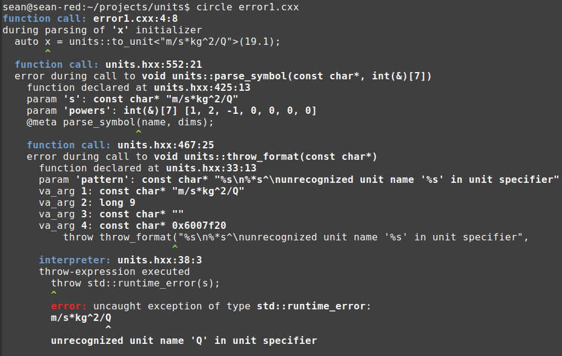

# Dimensional analysis and SI units with Circle

The [SI units](https://en.wikipedia.org/wiki/International_System_of_Units) define a standard of measurement for all physical reality that people care to study. It defines seven fundamental units:

1. time - second
1. length - meter
1. mass - kilogram
1. current - Ampere
1. temperature - Kelvin
1. amount - mole
1. luminous intensity - candela

This Circle library extends C++ type safety to operations on SI units. Attempting to add or subtract quantities with different units generates a compile-time error. Multiplying and dividing quantities adds up or divides their units, respectively. That is, dividing a quantity in meters by a quantity in seconds yields a quantity in meters/second. This type safety is enforced entirely at compile time, with no effect on runtime performance. 

Features unique to Circle are utilized to combine units, stringify SI quantities and to parse unit specifiers to types. This is accomplished without requiring much in the way of template metaprogramming. The Circle paradigm is to metaprogram using ordinary C/C++ functions. Template parameter packs may be unpacked into ordinary compile-time data structures, processed with ordinary functions, then expanded back into template arguments.

## The interface

```cpp
  auto c3 = to_unit<"m/s">(299792458.0); 
  print("c3");

  auto c4 = to_unit<"m*s^-1">(299792458.0); 
  print("c4");
```
```
c3 is 2.99792e+08 m/s
c4 is 2.99792e+08 m/s
```

The `to_unit` function template has a non-type string template parameter. This is parsed at compile time to determine the type of the result object. It supports not only SI fundamental units, but also derived units like Joules (J), Pascals (Pa) and Hertz (Hz).

Going the other direction, we can also print the quantity along with its formatted unit specifier using an overloaded << iostream operator. 

```cpp
  // Prints as 15.3 J.
  auto e1 = 15.3 * J;
  print("e1");

  // Also prints as 15.3 J. Joule is a registered derived type, so
  // any unit_t that exactly matches that unit is printed as J.
  auto e2 = 15.3 * kg * m2 / s2;
  print("e2");
```
```
e1 is 15.3 J
e2 is 15.3 J
```

The unit of e1 and e2 is kg * m2 / s2, but when printing to an iostream, J (for Joule) is printed, as its the SI derived unit that exactly matches this unit specifier. Construction of the unit specifier is performed entirely at compile time, and stored in the executable as a string constant. Much of the Circle philosophy is to allow you to execute everything you can at compile time, causing your executables to come out lean and fast.

The ability to parse and format strings at compile time leads to the generation of custom, domain-specific error messages. 

[**error1.cxx**](error1.cxx)
```cpp
#include "units.hxx"

int main() {
  auto x = units::to_unit<"m/s*kg^2/Q">(19.1);
}
```


The unit specifier Q is not a recognized SI type, so this is an illegal unit specifier. The parser formulates a helpful error message which repeats the full unit specifier and points to the offending token with a caret (^), followed by the unrecognized token name. This error is thrown as an `std::runtime_error` object at compile time. The Circle compiler catches this exception as it unwinds through the translation unit and constructs compile-time backtrace information. When the error is finally printed, we see that it's thrown from units.hxx:38:3, but really originates with the declaration at error1.cxx:4:8. 

The compile-time and runtime capabilities are more symmetric in Circle than in Standard C++. This extra power can be used to build your own domain-specific languages, complete with custom parsers and error messages, to help extend qualities of the C++ language to your own problem domain.

## Unit arithmetic

[**units.cxx**](units.cxx)
```cpp
#include "units.hxx"

@meta printf("SI fundamental units:\n");
@meta printf("  %s\n", @enum_names(units::dim_t))...;

@meta printf("SI derived units:\n");
@meta printf("  %s\n", @enum_names(units::derived_t))...;

@mauto print(const char* s) {
  return std::cout<< s<< " is "<< @@expression(s)<< "\n";
}

int main() {
  using namespace units;
  using namespace units::literals;

  auto c1 = 299782458.0 * m / s;
  print("c1");

  // User-defined literals always return double unit_t.
  auto c2 = 299782458.0_m / s;
  print("c2");

  // The type of the unit_t is inferred from its argument type.
  // The string template argument is parsed to yield the unit_t type.
  auto c3 = to_unit<"m/s">(299792458.0); 
  print("c3");

  auto c4 = to_unit<"m*s^-1">(299792458.0); 
  print("c4");

  // Declare with make_unit_t. Ugly when used as direct declaration, 
  // but possibly convenient for metaprogramming.
  auto c5 = make_unit_t<double, 
    power_t { dim_t::m, 1 }, 
    power_t { dim_t::s, -1 }
  > { 299792458.0 };
  print("c5");

  // The unit specifier parser supports negative powers.
  auto G1 = to_unit<"m^3*kg^-1*s^-2">(6.6743015e-11);
  print("G1");

  // It also supports positive powers after slashes.
  auto G2 = to_unit<"m^3/kg/s^2">(6.6743015e-11);
  print("G2");

  // Prints as 15.3 J.
  auto e1 = 15.3 * J;
  print("e1");

  // Also prints as 15.3 J. Joule is a registered derived type, so
  // any unit_t that exactly matches that unit is printed as J.
  auto e2 = 15.3 * kg * m2 / s2;
  print("e2");
}
```

Objects c1 - c5 are identical, but use five different initializers. c1 multiplies a double by `units::m`, which is a meter unit with value 1 (int). The multiplication promotes the result object to the common arithmetic type, double. The following division by `units::s` decrements the power on the second fundamental unit.

c2 uses the user-defined literal `operator""_m`, which is defined in namespace `units::literals`. This always returns a double-precision quantity.

c3 calls `units::to_unit` and provides a compile-time unit specifier, which is parsed against all known fundamental and derived SI units. The arithmetic type of the quantity is inferred from the function argument.

c4 calls the same function template, but demonstrates that a quotient can be used to change the sign of a power, not just a negative exponent after a caret.

c5 demonstrates a low-level interface, which is inconvenient for ordinary use but may be a good choice when metaprogramming. This interface is used to prime the library, as the constants for each of the seven fundamental units are defined with this interface.

## Representing SI units

[**units.hxx**](units.hxx)
```cpp
// Sort dimensions according to this order. Non-negative
// units go first, then negative units as denominators.

// Relate to fundamental types.
enum class dim_t {
  m,    // length
  kg,   // mass
  s,    // time
  A,    // current
  K,    // temperature
  mol,  // amount
  cd,   // luminous intensity
};
constexpr size_t dim_count = @enum_count(dim_t);

template<Arithmetic type_t, int... powers> 
struct unit_t {
  static_assert(sizeof...(powers) == dim_count);

  ...
```

The seven fundamental SI units are listed in a scoped enum. The quantity class template type, `unit_t`, is parameterized by a variadic parameter pack of the powers on each of the seven SI types. This is the simplest parameterization, as multiplying units just involves component-wise addition of their powers parameters. Dividing units involves subtraction of their powers parameters.

[**units.hxx**](units.hxx)
```cpp
// Compute a sum of the powers on each type.
struct power_t {
  dim_t dim;
  int power;    // Should be non-zero.
};

template<typename type_t, power_t... powers>
struct unit_builder_t {
  // Accumulate the exponent on each specified dimension into a 
  // compile-time buffer.
  @meta int dims[dim_count] { };
  @meta dims[(int)powers.dim] += powers.power ...;

  // Use the ranks to typedef a unit_t.
  typedef unit_t<type_t, dims...[:] ...> type;
};

template<typename type_t, auto... powers>
using make_unit_t = typename unit_builder_t<type_t, powers...>::type;
```

`make_unit_t` is the low-level interface for specifying typed quantities. Provide any number of `power_t` objects as template arguments, and the `unit_builder_t` class template definition accumulates their exponents into the seven SI unit power slots. A seven-element compile-time array is declared using the meta keyword. Then an expansion expression increments the counters for each template argument. Finally, a unit_t alias is declared by using the `...[:]` static slice operator on the `dims` array, turning it into a non-type parameter pack, and expanding that into the `unit_t` class template's argument list.

[**units.hxx**](units.hxx)
```cpp
// meter
template<typename type_t = double>
using meter_t = make_unit_t<type_t, power_t { dim_t::m, 1 }>;

// We can also use pack expansion to specify the ranks directly:
// using meter_t = unit_t<type_t, @enum_values(dim_t) == dim_t::m ...>;

// second
template<typename type_t = double>
using second_t = make_unit_t<type_t, power_t { dim_t::s, 1 }>;

// kg
template<typename type_t = double>
using kg_t = make_unit_t<type_t, power_t { dim_t::kg, 1 }>;

// A
template<typename type_t = double>
using A_t = make_unit_t<type_t, power_t { dim_t::A, 1 }>;

// K
template<typename type_t = double>
using K_t = make_unit_t<type_t, power_t { dim_t::K, 1 }>;

// mol
template<typename type_t = double>
using mol_t = make_unit_t<type_t, power_t { dim_t::mol, 1 }>;

// cd
template<typename type_t = double>
using cd_t = make_unit_t<type_t, power_t { dim_t::cd, 1 }>;
```

Alias templates for the seven fundamental units are declared using `make_unit_t`.

[**units.hxx**](units.hxx)
```cpp
inline constexpr meter_t<int> m { 1 };
inline constexpr auto m2 = m * m;
inline constexpr auto m3 = m * m2;

inline constexpr kg_t<int> kg { 1 };
inline constexpr auto kg2 = kg * kg;
inline constexpr auto kg3 = kg * kg2;

inline constexpr second_t<int> s { 1 };
inline constexpr auto s2 = s * s;
inline constexpr auto s3 = s * s2;

inline constexpr A_t<int> A { 1 };
inline constexpr auto A2 = A * A;
inline constexpr auto A3 = A * A2;

inline constexpr K_t<int> K { 1 };
inline constexpr auto K2 = K * K;
inline constexpr auto K3 = K * K2;

inline constexpr mol_t<int> mol { 1 };
inline constexpr auto mol2 = mol * mol;
inline constexpr auto mol3 = mol * mol2;;

inline constexpr cd_t<int> cd { 1 }; 
inline constexpr auto cd2 = cd * cd;
inline constexpr auto cd3 = cd * cd2;

// https://en.wikipedia.org/wiki/SI_derived_unit
inline constexpr auto Hz = 1 / s;
inline constexpr auto rad = m / m;
inline constexpr auto sr = m2 / m2;
inline constexpr auto N = kg * m / s2;
inline constexpr auto Pa = N / m2;
inline constexpr auto J = m * N;
inline constexpr auto W = J / s;
inline constexpr auto C = s * A;
inline constexpr auto V = W / A;
inline constexpr auto F = C / V;
inline constexpr auto ohm = V / A;
inline constexpr auto S = 1 / ohm;
inline constexpr auto Wb = J / A;
inline constexpr auto T = V * s / m2;
inline constexpr auto H = V * s / A;
inline constexpr auto lm = cd * sr;
inline constexpr auto lx = lm / m2;
inline constexpr auto Bq = 1 / s;
inline constexpr auto Gy = J / kg;
inline constexpr auto Sv = J / kg;
inline constexpr auto kat = mol / s;
```

We crank out identity-valued objects for small powers of the fundamental types, as well as many SI derived types. These objects serve as the most useful interface for accessing SI units functionality--simply multiply or divide by these objects to take on their units.

[**units.hxx**](units.hxx)
```cpp
// These derived units will be recognized by the parser and also
// printed by the stringifier if the unit matches exactly.
enum typename class derived_t {
  Hz = decltype(Hz),
  N = decltype(N),
  Pa = decltype(Pa),
  J = decltype(J),
  W = decltype(W),
  C = decltype(C),
  V = decltype(V),
  F = decltype(F),
  ohm = decltype(ohm),
  S = decltype(S),
  Wb = decltype(Wb),
  T = decltype(T),
  H = decltype(H),
  lm = decltype(lm),
  lx = decltype(lx),
  kat = decltype(kat),
};
```

Most of the derived types are collected in a typed enum, `derived_t`. Enums are iterable collections, and we can search through `derived_t` to match an operand unit against a recognized derived unit.

## Printing units

[**units.hxx**](units.hxx)
```cpp
// Search the derived units and fundamental units to make a canonical
// formatted string describing the unit with these powers.
inline std::string make_symbol(const int(&powers)[dim_count]) {
  // Attempt to match against the derived units. These must match exactly.
  // Otherwise SI fundamental units are used.
  @meta for enum(auto derived : derived_t) {
    if(@enum_type(derived)::compare_powers(powers)) {
      return @enum_name(derived);
    }
  }

  std::string s;

  // Print the positive symbols.
  for(size_t i = 0; i < dim_count; ++i) {
    int p = powers[i];
    if(p > 0) {
      if(s.size()) 
        s += "*";

      s += enum_to_string((dim_t)i);
      if(p > 1)
        s += "^" + std::to_string(p);
    }
  }

  // Print the negative symbols.
  for(size_t i = 0; i < dim_count; ++i) {
    int p = powers[i];
    if(p < 0) {
      s += "/";
      s += enum_to_string((dim_t)i);

      if(p < -1)
        s += "^" + std::to_string(-p);
    }
  }

  return s;
}

template<int... powers>
const char* make_symbol() {
  static_assert(sizeof...(powers) == dim_count);

  @meta const int powers2[] { powers... };
  return @string(make_symbol(powers2));
}
```

```cpp
template<Arithmetic type_t, int... powers> 
struct unit_t {
  ...
  static bool compare_powers(const int(&powers2)[dim_count]) {
    return (... && (powers == powers2...[:]));
  }
  ...
};
```

`make_symbol` is a function that takes an array of seven SI fundamental unit powers and constructs a unit specifier string. This is an ordinary function that uses `std::string` and `std::to_string`, which aren't constexpr, but we can use them at compile time in a meta context. The first thing is to compare the array of powers against each of the derived types, as collected in `derived_t`. Simply use a compile-time for-enum loop to iterate over each enumerator in `derived_t`. Call the static member function `compare_powers` on the derived unit ytpe to check that we have an exact match. If we do, use the introspection keyword `@enum_name` to return the string name of the derived unit. The effect is that if someone prints the type of "kg * m2 / s2", they get the unit symbol "J" out, since this derived type is better known as a Joule.

If the provided unit is not a registered derived unit, it's expressed in terms of products and quotients of the seven fundamental units. First fundamental units with positive exponents are printed and separated by asterisks. Next, fundamental units with negative exponents are printed and separated by slashes. If the magnitude of the exponent is greater than one, that exponent is printed after a caret.

## Parsing units

[**units.hxx**](units.hxx)
```cpp
// Parse a string non-type template parameter and return the corresponding
// unit type with the provided argument.
template<const char name[], typename type_t>
auto to_unit(type_t x) {
  // Parse the string non-type template parameter at compile time into an
  // array of powers.
  @meta int dims[dim_count] { };
  @meta parse_symbol(name, dims);

  // Expand the powers array into non-type template arguments.
  typedef unit_t<type_t, dims...[:] ...> unit_type;
  return unit_type { x };
}
```

`to_unit` is the function-template entry point that constructs a `unit_t` from a string unit specifier. At compile time we execute the `parse_symbol` function, which yields the exponent on each fundamental SI unit, and convert that into a static pack and expand it into the typedef for a `unit_t`. The function argument then direct-initializes this type.

[**units.hxx**](units.hxx)
```cpp
// Parse an input string against the SI derived and fundamental units.
// Return the powers in the output array.
inline void parse_symbol(const char* s, int(&powers)[dim_count]) {
  const char* begin = s;
  bool expect_token = false;
  while(char c = *s) {
    bool negative = false;
    if('/' == c) {
      ++s;
      negative = true;

    } else if(!expect_token || '*' == c) {
      if(expect_token) ++s;
      expect_token = true;

    } else 
      throw throw_format("%s\n%*s^\nexpected '*' or '/' in unit specifier", 
        begin, s - begin, "");

    // Scan to the end of the token.
    const char* s2 = s;
    while(*s2 && '*' != *s2 && '/' != *s2 && '^' != *s2)
      ++s2;

    // Match the token spelling against the SI unit enums.
    std::string spec(s, s2);
    int powers2[dim_count] { };

    if(auto e = string_to_enum<dim_t>(spec.c_str())) {
      // After matching a fundamental unit, increment that power.
      powers2[(int)*e] = 1;

    } else if(s2 == s) {
      throw throw_format("%s\n%*s^\nexpected SI unit name in unit specifier", 
        begin, s - begin, "");

    } else if(auto e2 = string_to_enum<derived_t>(spec.c_str())) {
      // After matching a derived unit, update all the powers. This requires
      // entering a switch over all the derived units in derived_t, and on
      // our match we can invoke the static member function write_powers to
      // write the compile-time powers into powers2 array.
      enum_f(*e2, [&](auto x) { x.write_powers(powers2); });

    } else {
      throw throw_format("%s\n%*s^\nunrecognized unit name '%s' in unit specifier", 
        begin, s - begin, "", spec.c_str());
    }

    s = s2;
    int count = 1;
    if('^' == *s) {
      ++s;
      if('-' == *s) {
        ++s;
        negative = !negative;
      }

      int digits = sscanf(s, "%d", &count);
      if(digits <= 0)
      throw throw_format("%s\n%*s^\ncannot parse power in unit specifier", 
        begin, s - begin, "", spec.c_str());
      
      s += digits;
    }

    if(negative)
      count = -count;

    // Accumulate the power.
    powers...[:] += count * powers2...[:] ...;
  }
}
```

`parse_symbol` is an ad hoc parser. It's not a constexpr function, and it uses plenty of mechanisms that aren't available in a constexpr context, like std::string and exceptions. However, with Circle, we can execute this at compile time in the integrated interpreter.

The first thing we do is use `string_to_enum` to check if the lexed unit name is an SI _fundamental_ unit: we search `dim_t` for these. If it is, the corresponding slot in the `powers2` array is incremented. 

Next, we use `string_to_enum` to check if the lexed unit name is an SI _derived_ unit. If this matches, we call into `enum_f` and pass a lambda function which invokes the static member function `write_powers`. This fills `powers2` with the exponents on each fundamental unit that comprise the derived unit.

If the lexed unit name doesn't match a fundamental or derived unit, an exception is thrown. `throw_format` wraps `vsnprintf`, allowing us to use printf-style format specifiers to create an error message. The printf specifier `%*s^` consumes two variadic arguments: the offset within the unit specifier, s - begin, and an empty string literal "". This injects s - begin spaces, and then prints the caret, to indicate the exact character within the unit specifier at which the error occurred. This gives the printed error a real custom quality.

Finally, at the end of each individual unit specifier, the `powers` array is incremented by scaling the `powers2` array. `powers...[:] += count * powers2...[:] ...` turns each array into a static parameter pack, performs an element-wise assignment, and expands the packs with the expansion token `...` on the right-hand side. This lets us treat array types like arithmetic types.

It's worth noting that `to_unit`'s function definition is only instantiated once per unique non-type string argument, so `parse_symbol` only parses each unique string just once per translation unit. Template arguments are hashed, and template definitions are memoized.